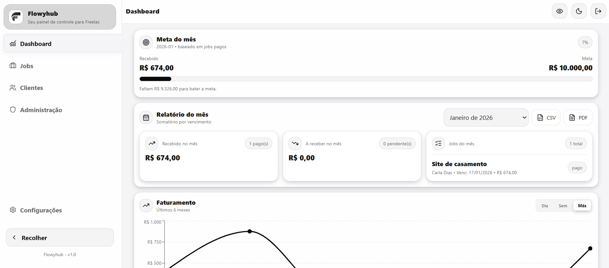
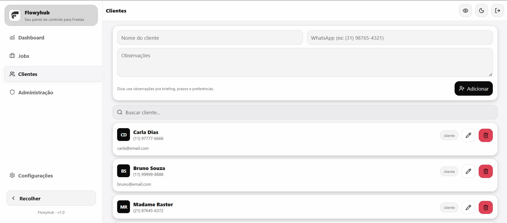
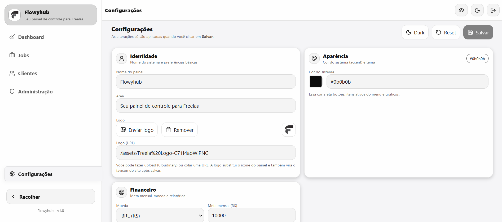

<div align="center">
  
  <h1>Painel Freela MVP</h1>
  
  <p>
    <strong>Gestão inteligente para freelancers de alta performance.</strong>
  </p>

  <p>
    <a href="#-funcionalidades">Funcionalidades</a> •
    <a href="#-tecnologias">Tecnologias</a> •
    <a href="#-instalação">Instalação</a> •
    <a href="#-licença">Licença</a>
  </p>

  <p>
    
    
    
  </p>
</div>

<br />

> **Nota**: Um sistema moderno, construído com React e Firebase, focado em simplicidade e eficiência para o dia a dia de quem trabalha por conta própria.

---

## 📸 Visão Geral

<div align="center">
  
  <p><em>Dashboard com métricas financeiras, metas mensais e gráficos interativos.</em></p>
</div>

<br />

### 📱 Interface Responsiva & Intuitiva

<div align="center">
  <div style="display: flex; gap: 10px; justify-content: center; flex-wrap: wrap;">
    
    
  </div>
  <p><em>Gerencie seus clientes e acompanhe o status de cada job com facilidade.</em></p>
</div>

<br />

<div align="center">
  <div style="display: flex; gap: 10px; justify-content: center; flex-wrap: wrap;">
    
    
  </div>
  <p><em>Personalize sua experiência com temas Dark/Light e controle total via Admin.</em></p>
</div>

---

## ✨ Funcionalidades

<table>
  <tr>
    <td>
      <h3>🔐 Autenticação Robusta</h3>
      <p>Login seguro via Firebase Auth com suporte a recuperação de senha e persistência de sessão.</p>
    </td>
    <td>
      <h3>👥 Gestão de Clientes</h3>
      <p>Cadastro completo, edição e exclusão de clientes, com avatares gerados automaticamente.</p>
    </td>
  </tr>
  <tr>
    <td>
      <h3>💼 Controle de Projetos</h3>
      <p>Organize seus jobs por status (Pendente, Em Andamento, Concluído) e acompanhe os prazos.</p>
    </td>
    <td>
      <h3>💰 Dashboard Financeiro</h3>
      <p>Receita mensal, anual, curva ABC de clientes e definição de metas financeiras.</p>
    </td>
  </tr>
  <tr>
    <td>
      <h3>🎨 UI/UX Premium</h3>
      <p>Modo Dark/Light automático, transições suaves, modais responsivos e design system consistente.</p>
    </td>
    <td>
      <h3>🛡️ Administração</h3>
      <p>Painel exclusivo para admins gerenciarem usuários e limparem dados sensíveis.</p>
    </td>
  </tr>
</table>

---

## 🛠 Tecnologias

Este projeto foi desenvolvido utilizando as melhores práticas e ferramentas do ecossistema moderno de desenvolvimento web.

- **[React](https://reactjs.org/)** — Biblioteca core para a interface.
- **[Vite](https://vitejs.dev/)** — Build tool ultra-rápida.
- **[Firebase](https://firebase.google.com/)** — Autenticação e Banco de Dados (Firestore) em tempo real.
- **[Styled Components](https://styled-components.com/)** — Estilização CSS-in-JS com suporte a temas dinâmicos.
- **[Recharts](https://recharts.org/)** — Biblioteca de gráficos compostos e flexíveis.
- **[Lucide React](https://lucide.dev/)** — Ícones leves e consistentes.

---

## 🚀 Instalação e Uso

Pré-requisitos: [Node.js](https://nodejs.org/) instalado.

```bash
# 1. Clone o repositório
git clone https://github.com/DevGabriel0402/painel-freela.git

# 2. Entre no diretório
cd painel-freela

# 3. Instale as dependências
npm install

# 4. Configure o Firebase
# Crie um arquivo .env na raiz com suas credenciais:
# VITE_API_KEY=...
# VITE_AUTH_DOMAIN=...
# (Verifique firebaseConfig.js para a lista completa)

# 5. Inicie o servidor
npm run dev
```

---

## 🤝 Contribuição

Contribuições são bem-vindas! Sinta-se à vontade para abrir issues ou enviar pull requests.

1.  Faça um Fork do projeto
2.  Crie uma Branch para sua Feature (`git checkout -b feature/MinhaFeature`)
3.  Faça o Commit (`git commit -m 'Add some AmazingFeature'`)
4.  Push para a Branch (`git push origin feature/MinhaFeature`)
5.  Abra um Pull Request

---

## 📄 Licença

Este projeto está sob a licença MIT. Veja o arquivo [LICENSE](LICENSE) para mais detalhes.

<br />

<div align="center">
  <p>Desenvolvido com 💜 por <strong>Gabriel</strong></p>
  
  <a href="https://wa.me/5531991660594">
    
  </a>
   <a href="mailto:gabriellucas2301@gmail.com">
    
  </a>
</div>
